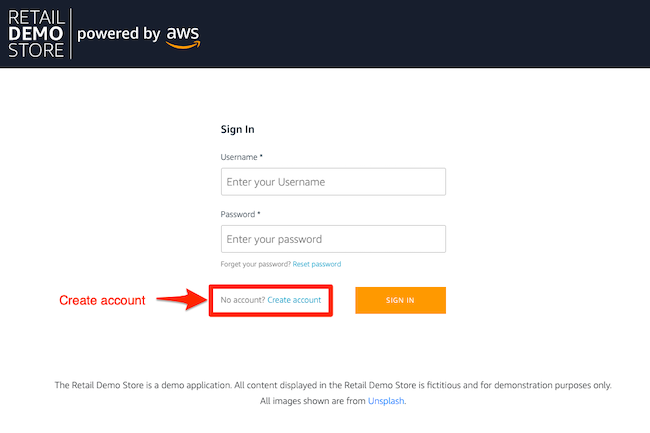
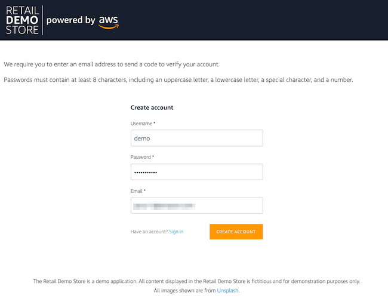
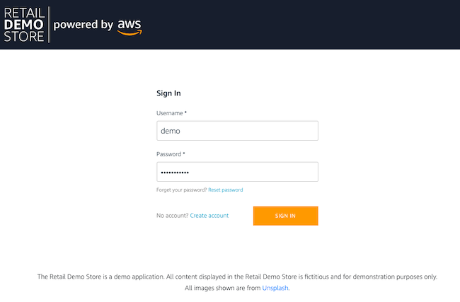

[Overview](./) > 1 - Creating the Account > [2 - Personalization](2-Personalization.md)

# Creating a Retail Demo Store account

> Before getting started, we advise you to use a Private Window (Firefox) or Incognito Window (Chrome) to make sure you don't mix different demo profiles in the same browser session

Since several of the features of the Retail Demo Store require a user/customer account to demonstrate effectively, this section will describe the process of creating a user account using the Retail Demo Store’s web user interface. This process also provides a good demonstration of how Amazon Cognito is used to implement user account and authentication.

Click the “Sign In” button in the right side of the top navigation bar. This will take you to the Sign In page. Click the “Create account” link at the bottom of the Sign In form as shown below. These forms are provided by Cognito.

Figure 3. Create Account Link.

Complete the “Sign Up Account” form by entering appropriate values in each field. Note that your password must meet the complexity requirements configured in Amazon Cognito (upper- and lower-cased characters, numbers, and special characters). In addition, be sure to enter your actual mobile phone number (if possible) since Cognito will send you a confirmation code via SMS once you submit the form. Otherwise, if you enter a fake phone number, the only way to confirm your account is manually in the Cognito User Pool page in the AWS console. If you need to create multiple accounts to demonstrate behavior across users, a useful tip is to append a different mailbox name (“+” notation) to the username portion of your email address for each user account. For example, login+user5@example.com. You will still receive emails addressed using this format in your inbox.

Figure 4. Create Account page.
Within a few seconds after pressing the “Create Account” button on the “Sign Up Account” form you should receive an SMS on your mobile phone. The SMS will contain a 6-digit confirmation code. Enter this code on the “Confirm Sign Up” form and press the “Confirm” button. If you don’t receive a confirmation code, you can have it resent or you can manually confirm your user account in the Amazon Cognito User Pool page in the AWS console in the AWS account where the Retail Demo Store instance has been deployed.

Figure 5. Confirm New Account.
Once your user account has been confirmed, you can sign in to your account with your username and password.

Figure 6. Sign In to Account.
You can tell if you’re signed in if the “Sign In” button in the top navigation is replaced by your username.

# Next Steps

1) [Personalized Experience](2-Personalization.md)